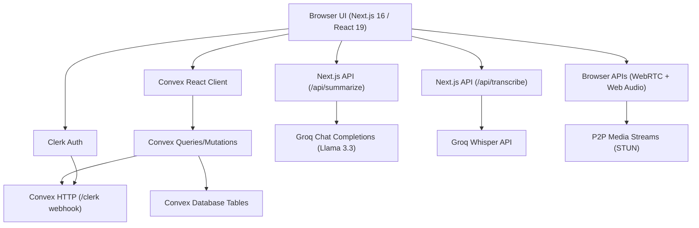

# 🎙️ Smart Meeter

[](https://nextjs.org/)
[](https://react.dev/)
[](https://convex.dev/)
[](https://clerk.com/)
[](https://tailwindcss.com/)

**Smart Meeter (MeetMind AI)** is a real-time, collaborative video conferencing platform featuring auto-transcription, AI-generated meeting summaries, action items extraction, and automated task tracking. Built with modern React 19, Next.js 16, Convex, Clerk, WebRTC, and Groq's high-speed AI inference models.

---

## ✨ Features

- **🔒 Organization-Scoped Multi-Tenancy**: Built-in tenant isolation and organization switching powered by Clerk.
- **📹 Real-Time WebRTC Video Rooms**: Peer-to-peer audio, video, and screen sharing using Google's STUN signaling protocol managed dynamically through Convex tables.
- **💬 Reactive Chat & Room Presence**: Real-time message exchanges and live status tracking (mic, camera, screensharing, heartbeat) for all room participants.
- **✍️ Multilingual Live Transcription**: Real-time microphone audio capture processed via Groq Whisper (`whisper-large-v3`). Supports `Auto`, `English`, `Hindi`, and `Hinglish` translation/transcription modes.
- **🤖 Intelligent Meeting Summaries**: Automated AI summarization via Groq Llama 3.3 (`llama-3.3-70b-versatile`) that outputs detailed summaries, key points, and core decisions.
- **✅ Automagic Action Items & Tasks**: Action items generated from meetings are automatically extracted and converted into interactive, trackable organization tasks.
- **🎨 Modern Design System**: Editorial-grade dark theme powered by Tailwind CSS v4, Radix UI, and shadcn/ui. Built with soft-minimalist tonal layering, removing harsh 1px borders in favor of background depth shifts.
- **📈 Workspace Insights**: Real-time analytics dashboards presenting organizational productivity metrics, meeting frequency, and timeline views via Recharts.
- **📓 Collaborative Whiteboarding**: Embedded whiteboards powered by Excalidraw for real-time visual collaboration.

---

## 🏗️ High-Level Architecture

The project utilizes a highly reactive serverless architecture. Frontend components subscribe directly to Convex databases, creating an instantly updating UI experience without manual polling or refetching.



---

## 📁 File Structure

```text
Smart_Meeter/
├── app/                        # Next.js App Router root
│   ├── (auth)/                 # Clerk Auth routes (Sign-in/up)
│   ├── (dashboard)/            # Dashboard, meetings, tasks, settings
│   ├── (meeting-room)/         # Active video meeting room & controls
│   ├── (onboarding)/           # User and Org setup onboarding flow
│   ├── api/                    # API endpoints for AI summarization/transcription
│   └── providers/              # Global state & service providers
├── components/                 # Reusable React & UI primitives
│   ├── ui/                     # Radix & shadcn/ui base primitives
│   ├── dashboard/              # Widgets, metrics, and chart views
│   └── home/                   # Marketing and landing page components
├── features/                   # Core business domain logic
│   ├── ai/                     # AI transcription processing hooks & APIs
│   ├── meeting/                # Meeting models, dialogs, forms, views
│   ├── tasks/                  # Tasks management views & logic
│   └── webrtc/                 # WebRTC hooks, track managers, participant grids
├── convex/                     # Backend serverless database & logic
│   ├── schema.ts               # Core database schemas
│   ├── users.ts / meetings.ts  # Database operations & validation
│   └── http.ts                 # Clerk webhooks mirror endpoints
├── hooks/                      # Global helper hooks (mobile detection, etc.)
└── lib/                        # Utility scripts and metadata helper functions
```

---

## ⚙️ Getting Started

### Prerequisites
Make sure you have [Node.js](https://nodejs.org/) installed on your machine.

### 1. Clone the Repository
```bash
git clone https://github.com/Tanmay-Mirgal/Smart-Meeter.git
cd Smart-Meeter
```

### 2. Install Dependencies
```bash
npm install
```

### 3. Set Up Environment Variables
Create a `.env.local` file in the root directory and configure the following:

```env
# Next Public Clerk Settings
NEXT_PUBLIC_CLERK_PUBLISHABLE_KEY=your_clerk_publishable_key
CLERK_SECRET_KEY=your_clerk_secret_key
NEXT_PUBLIC_CLERK_SIGN_IN_URL=/sign-in
NEXT_PUBLIC_CLERK_SIGN_UP_URL=/sign-up

# Convex Deployment
NEXT_PUBLIC_CONVEX_URL=your_convex_deployment_url

# Groq API Key (for Transcription & Summary)
GROQ_API_KEY=your_groq_api_key

# Clerk Webhook Secret (for User Sync)
CLERK_WEBHOOK_SECRET=your_clerk_webhook_secret
```

### 4. Start the Convex Backend
In a separate terminal, launch the Convex development server. This compiles and deploys your schema, functions, and listens for changes:
```bash
npx convex dev
```

### 5. Run the Frontend Development Server
In your main terminal, start the Next.js development server:
```bash
npm run dev
```

Open [http://localhost:3000](http://localhost:3000) in your browser to view the application.

---

## 🛠️ Build and Linting

- **Run Linter**: `npm run lint`
- **Build Production App**: `npm run build`
- **Start Production Server**: `npm run start`

---

## 🔮 Future Enhancements & Roadmap
- [ ] **STUN/TURN Integration**: Implementing full TURN servers to support peer-to-peer connections behind strict corporate firewalls.
- [ ] **Advanced Meeting Analytics**: Sentiment timelines, talk-time stats per participant, and historical org-wide meeting logs.
- [ ] **Recording Persistence**: Storing full WebRTC recording video chunks inside Convex File Storage or AWS S3 for post-meeting playbacks.
- [ ] **Stripe Monetization**: Integrating paid billing tiers for higher usage limits (e.g., transcripts quota or custom integrations).
